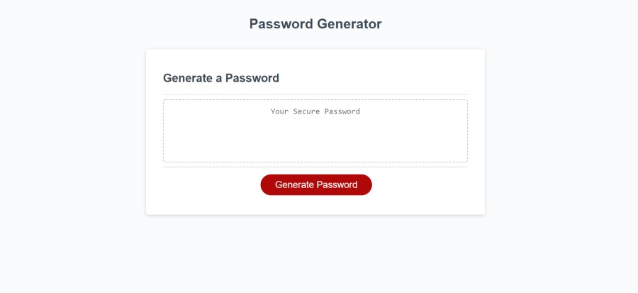

<h1 align="center">Random Password Generator</h1>

    
    
    

  

    

  

## Table of Contents
- [Description](#description)
- [Installation](#install)
- [Usage](#usage)
- [Questions](#questions)

## Description
This very simple site helps the user creat a random password. The Random Password Generator promts you to answer questions for the criteria you want the password to contain. Upon completeion of the prompts, it will provide you with a completely random password.   
  
## Install
Clone Repo to computer

## Usage
Open index.html

## Below is a link to the GitHub repository   

[Random Password Generator Repo](https://github.com/mattkohl82/RanPassGen)    

### Deployed Site
[Random Password Generator Deployed Site](https://mattkohl82.github.io/RanPassGen/) 

## Questions

#### [Mattkohl82 for GitHub](https://github.com/Mattkohl82) 
 
#### mattkohl82@gmail.com for ✉️ email 
